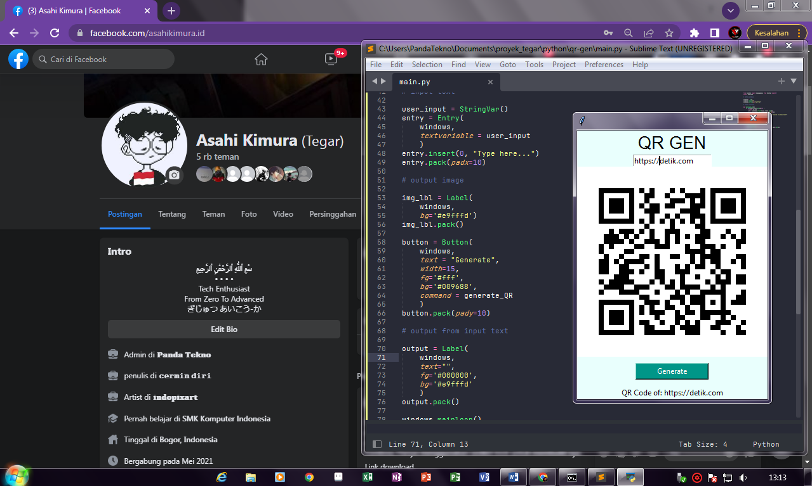

<h1 align="center">QR Gen Desktop</h1>

## Tentang Aplikasi

> **Deskripsi**
> - Ini adalah aplikasi/software generator Kode QR untuk desktop.

## :camera_flash: Screenshots

- UI

  > Main

  

## Credits

- [w3css theme teal](https://www.w3schools.com/w3css/tryit.asp?filename=tryw3css_theme_teal) color palette teal

## Download
- [click here](https://github.com/pandatekno/QrGen-desktop/releases/tag/v1.0)
